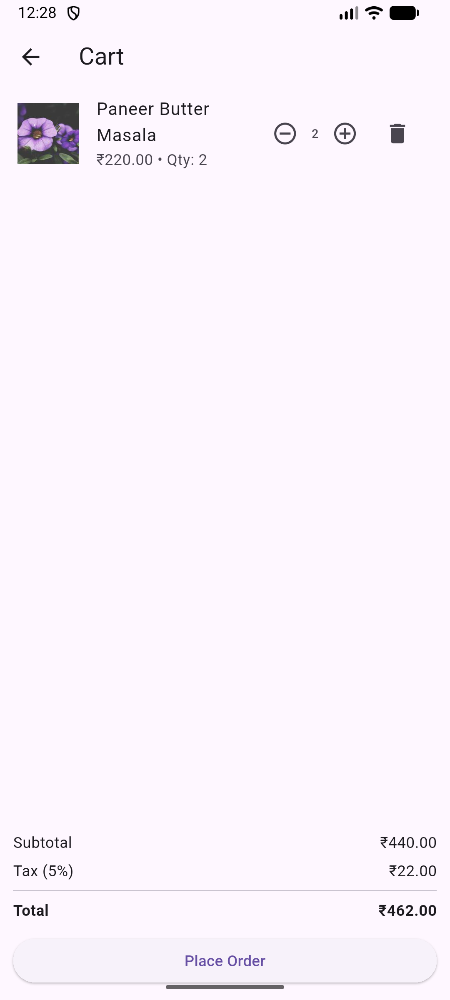
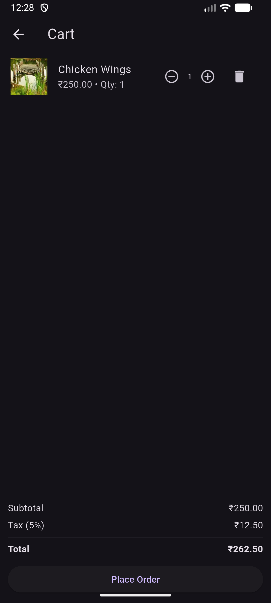
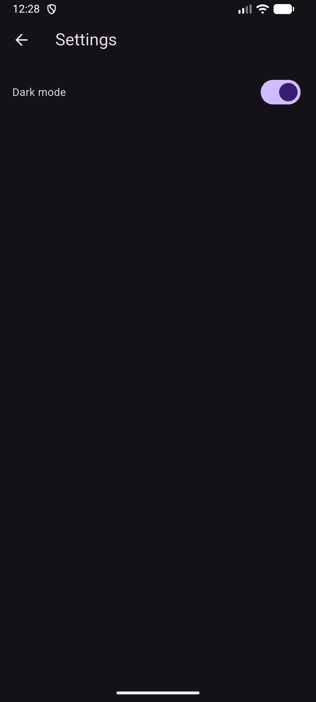

# ordermanagement

A mobile application built using **Flutter + Provider + Shared Preferences** that allows users to browse a restaurant menu, add items to a cart, and place an order.

---

## 📱 Features

| Feature | Description |
|--------|-------------|
| 📋 Menu Page | Browse categorized restaurant menu (Starters, Main Course, Desserts) |
| 🛒 Cart Functionality | Add / remove items, increment/decrement quantity |
| 🧾 Order Summary | Generates unique Order ID |
| 💾 Local Storage | Cart items stored in Shared Preferences |
| 🎨 Theme Support | Light / Dark mode toggle & save preference |

---

## 🖥️ Tech Stack

- **Flutter**
- **Provider (State Management)**
- **Shared Preferences (Local storage)**
- **Local JSON (Menu Data)**

## 📸 App Screenshots

### Menu Screen

### Cart Screen

### Order Confirmation

### Settings Screen

